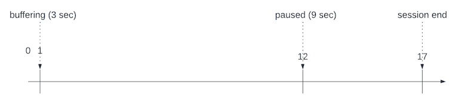
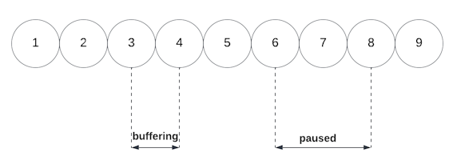
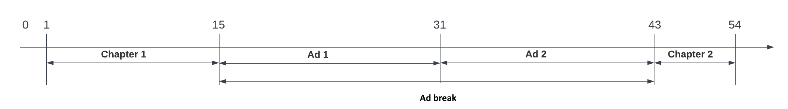
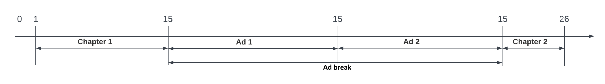
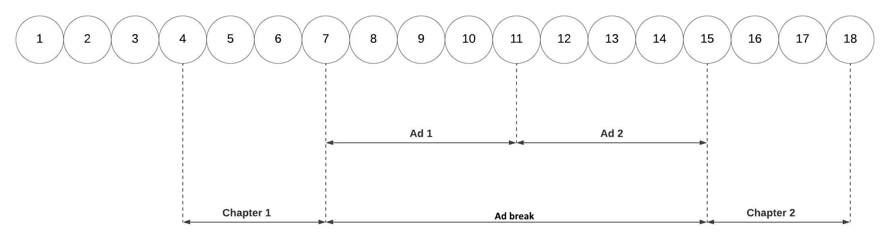

# Media Edge API implementation examples

This page provides two examples on how you can structure your API calls to successfully collect a media tracking session.

An API call is made for each action that you want to track. Once the media session ends, all API calls are recompiled into events that Adobe Experience Platform can ingest into a dataset. Expect to send many Media Edge API calls that end up as a smaller number of rows within a dataset. On average, approximately 6 API calls are used per event recorded in a dataset.

Some helpful tips to keep in mind regarding these examples:

* The playhead position (the current position indicated in the horizontal timeline of the video) does not advance during buffering, pausing, or an ad break, even though real time has elapsed. Both playhead position and the passing of real time are measured in seconds.
* The events sent are ordered based on the timestamp at which they were sent. If they are sent at the same second, as illustrated in the examples below, they are still sent with different ascending timestamps.
* For media tracking, you must fire ping events every 10 seconds, tracked in real-time, beginning after 10 seconds have elapsed from the session start. This must happen regardless of other API events that you have sent.
* The `timestamp` values in the payload examples below are generic for the year, month, and day, but show specific hours, minutes, seconds, and milliseconds. This is to show how the values correspond to the progressing events. The session starts with the following `timestamp` value: `YYYY-MM-DDT02:00:00.000Z`.

## Prerequisites

Before following these examples, make sure that you have an API environment set up based on the steps outlined on the [Getting started overview](index.md) page, specifically:

* Create a schema (make sure to add the **MediaAnalytics Interaction Details** field group)
* Create a dataset
* Create a datastream

## Example 1: Buffer state and a pause

This example contains the following elements:

* A `buffering` state.
* The user pressing `pause`.
* The user closing the app without finishing the content to the end.

The following actions and playhead diagrams show the differences in time during a buffer and a pause:

* **Playhead diagram**:

   

* **Action diagram**:

   

The following table shows a timeline of actions to be tracked for this example. Each row summarizes the action and the request endpoint. Each action is described in more detail with payloads below the table. The **Client Request** column shows the final path parameter and other parameters required to include in the call.

| Number | Action | Elapsed Real-Time (from beginning) | Playhead Position | Client Request |
| --- | --- | --- | --- | --- |
| 1 | The auto-play function occurs, or the play button is pressed, and the video starts loading | 0 | 0 | `/sessionStart?configId=<datastreamID>` |
| 2 | The ping event timer starts | 0 | 0 | `/ping?configId=<datastreamID>` |
| 3 | Tracks the buffer start | 1 | 1 | `/bufferStart?configId=<datastreamID>` |
| 4 | Tracks the end of the buffer and a play event is sent | 4 | 1 | `/play?configId=<datastreamID>` |
| 5 | Sends a ping | 10 | 7 | `/ping?configId=<datastreamID>` |
| 6 | User presses `pause` | 15 | 12 | `/pauseStart?configId=<datastreamID>` |
| 7 | Sends a ping | 20 | 12 | `/ping?configId=<datastreamID>` |
| 8 | User presses `play` to resume the main content | 24 | 12 | `/play?configId=<datastreamID>` |
| 9 | User closes the app without watching the content to the end | 29 | 17 | `/sessionEnd?configId=<datastreamID>` |

Each timeline action shown in the previous table is described in detail below. Each description includes the payload that is sent as part of a Media Edge API request.

<AccordionItem slots="heading, table, text, code"/>

### 1. Start play

| Number | Action | Elapsed Real-Time (from beginning) | Playhead Position | Client Request |
| --- | --- | --- | --- | --- |
| 1 | The auto-play function occurs, or play button is pressed, and the video starts loading | 0 | 0 | `/sessionStart?configId=<datastreamID>` |

This call signals the intention of the user to play a video. The player state is not yet `playing`, but is instead `starting`. This call returns a Session ID which is referenced in the following examples with `{SID}`. The `{SID}`, is returned to the client and is used to identify all subsequent tracking calls within the session.  This call also generates a reporting event that is pushed to AEP and/or Analytics, depending on datastream configuration. Mandatory parameters must be included.

```json
{
 "eventType": "media.sessionStart",
  "timestamp": "YYYY-MM-DDT02:00:00.000Z",
  "mediaCollection": {
    "playhead": 0,
    "sessionDetails": {
      "name": "VA API Sample Player",
      "friendlyName": "ClickMe",
      "length": 60,
      "contentType": "VOD",
      "playerName": "sample-html5-api-player",
      "channel": "sample-channel",
      "appVersion": "va-api-0.0.0"
    }
  }
}
```

<AccordionItem slots="heading, table, text"/>

### 2. Ping event timer

| Number | Action | Elapsed Real-Time (from beginning) | Playhead Position | Client Request |
| --- | --- | --- | --- | --- |
| 2 | The ping event timer starts | 0 | 0 | `/ping?configId=<datastreamID>` |

The application starts the [ping timer](https://experienceleague.adobe.com/docs/media-analytics/using/implementation/analytics-only/streaming-media-apis/mc-api-impl/mc-api-sed-pings.html). A call is not sent for this event, but the first ping call should be fired 10 seconds later.

<AccordionItem slots="heading, table, text, code"/>

### 3. Track buffer start

| Number | Action | Elapsed Real-Time (from beginning) | Playhead Position | Client Request |
| --- | --- | --- | --- | --- |
| 3 | Tracks the buffer start | 1 | 1 | `/bufferStart?configId=<datastreamID>` |

Player enters the `buffering` state. Because content is not being played the playhead is not advancing.

```json
{
  "eventType": "media.bufferStart",
  "timestamp": "YYYY-MM-DDT02:00:01.000Z",
  "mediaCollection": {
    "sessionID": "{SID}",
    "playhead": 0
  }
}
```

<AccordionItem slots="heading, table, text, code"/>

### 4. Track buffer end

| Number | Action | Elapsed Real-Time (from beginning) | Playhead Position | Client Request |
| --- | --- | --- | --- | --- |
| 4 | Tracks the end of the buffer and a play event is sent | 4 | 1 | `/play?configId=<datastreamID>` |

Player buffering ends after 3 seconds so a `play` call is sent to put the player into the `playing` state. Sending a `play` call after the `bufferStart` call has been sent automatically ends the `buffering` state.

```json
{
  "eventType": "media.play",
  "timestamp": "YYYY-MM-DDT02:00:04.000Z",
  "mediaCollection": {
    "sessionID": "{SID}",
    "playhead": 1
  }
}
```

<AccordionItem slots="heading, table, text, code"/>

### 5. Ping

| Number | Action | Elapsed Real-Time (from beginning) | Playhead Position | Client Request |
| --- | --- | --- | --- | --- |
| 5 | Sends a ping | 10 | 7 | `/ping?configId=<datastreamID>` |

A ping call is sent to the backend every 10 seconds.

```json
{
  "eventType": "media.ping",
  "timestamp": "YYYY-MM-DDT02:00:10.000Z",
  "mediaCollection": {
    "sessionID": "{SID}",
    "playhead": 7
  }
}
```

<AccordionItem slots="heading, table, text, code"/>

### 6. User pauses

| Number | Action | Elapsed Real-Time (from beginning) | Playhead Position | Client Request |
| --- | --- | --- | --- | --- |
| 6 | User presses `pause` | 15 | 12 | `/pauseStart?configId=<datastreamID>` |

The user pauses the video. This moves the play state to `paused`.

```json
{
  "eventType": "media.pauseStart",
  "timestamp": "YYYY-MM-DDT02:00:15.000Z",
  "mediaCollection": {
    "sessionID": "{SID}",
    "playhead": 12
  }
}
```

<AccordionItem slots="heading, table, text, code"/>

### 7. Ping

| Number | Action | Elapsed Real-Time (from beginning) | Playhead Position | Client Request |
| --- | --- | --- | --- | --- |
| 7 | Sends a ping | 20 | 12 | `/ping?configId=<datastreamID>` |

A ping call is sent to the backend every 10 seconds. The player remains in a `paused` state.

```json
{
  "eventType": "media.ping",
  "timestamp": "YYYY-MM-DDT02:00:20.000Z",
  "mediaCollection": {
    "sessionID": "{SID}",
    "playhead": 12
  }
}
```

<AccordionItem slots="heading, table, text, code"/>

### 8. User presses play

| Number | Action | Elapsed Real-Time (from beginning) | Playhead Position | Client Request |
| --- | --- | --- | --- | --- |
| 8 | User presses `play` to resume the main content | 24 | 12 | `/play?configId=<datastreamID>` |

The user presses `play`. This moves the play state to `playing`. There is no need for a separate `resume` event.

```json
{
  "eventType": "media.play",
  "timestamp": "YYYY-MM-DDT02:00:24.000Z",
  "mediaCollection": {
    "sessionID": "{SID}",
    "playhead": 12
  }
}
```

<AccordionItem slots="heading, table, text, code"/>

### 9. User closes player

| Number | Action | Elapsed Real-Time (from beginning) | Playhead Position | Client Request |
| --- | --- | --- | --- | --- |
| 9 | User closes the app without watching the content to the end | 29 | 17 | `/sessionEnd?configId=<datastreamID>` |

The user closes the app. `sessionEnd` is sent to the Media Edge API to signal that the session should be closed immediately, with no further processing.

```json
{
  "eventType": "media.sessionEnd",
  "timestamp": "YYYY-MM-DDT02:00:29Z",
  "mediaCollection": {
    "sessionID": "{SID}",
    "playhead": 17
  }
}
```

## Example 2: Two chapters separated by an ad break

This section provides an example tracking a media session with the Media Edge API service. The example session shown for this use case contains the following elements:

* Two chapters: `Chapter 1` and `Chapter 2`.
* An ad break inserted at the middle of the content that contains two ads: `Ad 1` and `Ad 2`.

The following action and playhead diagrams show the differences in time during an ad break.

* **Action diagram**:

   

* **Playhead diagram**:

   

The following diagram shows a timeline of actions for this example session. Each number (1-18) represents an action and its request endpoint. These numbers also correspond to event descriptions in both the **Timeline summary table** and the **Detailed descriptions** section below.



The Client request column in the table below shows the final path parameter and the other parameters required to include in the call.

| Number | Action | Elapsed Real-Time (from beginning in seconds) | Playhead Position (in seconds)| Client request |
| --- | --- | --- | --- | --- |
| 1 | The auto-play function occurs, or the Play button is pressed, and the video starts loading. | 0 | 0 | `/sessionStart?configId=<datastreamID>` |
| 2 | The [ping event timer](https://experienceleague.adobe.com/docs/media-analytics/using/implementation/analytics-only/streaming-media-apis/mc-api-impl/mc-api-sed-pings.html) starts | 0 | 0 | `/ping?configId=<datastreamID>` |
| 3 | Tracks the `play` event | 0 | 0 | `/play?configId=<datastreamID>` |
| 4 | Tracks the start of `Chapter 1` | 1 | 1 | `/chapterStart?configId=<datastreamID>` |
| 5 | Sends a ping | 10 | 10 | `/ping?configId=<datastreamID>` |
| 6 | Tracks the completion of `Chapter 1` | 15 | 15 | `/chapterComplete?configId=<datastreamID>` |
| 7 | Tracks the start of ad break | 15 | 15 | `/adBreakStart?configId=<datastreamID>` |
| 8 | Tracks the start of `Ad 1` in ad break | 15 | 15 | `/adStart?configId=<datastreamID>` |
| 9 | Sends a ping twice during `Ad 1`, each 10 seconds apart | 20, 30 | 15, 15 | `/ping?configId=<datastreamID>` |
| 10 | Tracks completion of `Ad 1` | 31 | 15 | `/adComplete?configId=<datastreamID>` |
| 11 | Tracks the start of `Ad 2` in ad break | 31 | 15 | `/adStart?configId=<datastreamID>` |
| 12 | Sends ping | 40 | 15 | `/ping?configId=<datastreamID>` |
| 13 | Tracks completion of `Ad 2` | 43 | 15 | `/adComplete?configId=<datastreamID>` |
| 14 | Tracks completion of ad break | 43 | 15 | `/adBreakComplete?configId=<datastreamID>` |
| 15 | Tracks the start of `Chapter 2` | 43 | 15 | `/chapterStart?configId=<datastreamID>` |
| 16 | Sends ping | 50 | 22 | `/ping?configId=<datastreamID>` |
| 17 | Tracks completion of `Chapter 2`| 54 | 26 | `/chapterComplete?configId=<datastreamID>` |
| 18 | Tracks completion of session when user finishes watching the content to the end | 55 | 26 | `/sessionComplete?configId=<datastreamID>` |

Each timeline action shown in the previous table is described in detail below. Each description includes the payload that is sent as part of a Media Edge API request.

<AccordionItem slots="heading, table, text, code"/>

### 1. Session start

| Number | Action | Elapsed Real-Time (from beginning) | Playhead Position | Client request |
| --- | --- | --- | --- | --- |
| 1 | The auto-play function occurs or Play button is pressed and the video starts loading | 0 | 0 | `/sessionStart?configId=<datastreamID>` |

This call signals the intent of the user to play a video and returns a Session ID {SID} to the client. The {SID} is used to identify all subsequent tracking calls within the session.  This call also generates a reporting event that is pushed to either Adobe Experience Platform, or Adobe Analytics, or both, depending on your datastream configuration. This action represents the start of the process but not yet in the *playing* state. Required parameters must be included, as shown in [endpoint reference](https://experienceleague.adobe.com/docs/experience-platform/edge-network-server-api/media-edge-apis/swagger.html).

```json
{
  "eventType": "media.sessionStart",
  "timestamp": "YYYY-MM-DD`T02:00:00.000Z",
  "mediaCollection": {
    "playhead": 0,
    "sessionDetails": {
      "name": "VA API Sample Player",
      "friendlyName": "ClickMe",
      "length": 54,
      "contentType": "VOD",
      "playerName": "sample-html5-api-player",
      "channel": "sample-channel",
      "appVersion": "va-api-0.0.0"
    }
  }
}
```

<AccordionItem slots="heading, table, text"/>

### 2. Ping timer starts

| Number | Action | Elapsed Real-Time (from beginning) | Playhead Position | Client request |
| --- | --- | --- | --- | --- |
| 2 | The ping event timer starts | 0 | 0 | `/ping?configId=<datastreamID>` |

The application starts the [ping timer](https://experienceleague.adobe.com/docs/media-analytics/using/implementation/analytics-only/streaming-media-apis/mc-api-impl/mc-api-sed-pings.html). A call is not sent for this event, but the first ping call should be fired 10 seconds later.

<AccordionItem slots="heading, table, text, code"/>

### 3. Track play

| Number | Action | Elapsed Real-Time (from beginning) | Playhead Position | Client request |
| --- | --- | --- | --- | --- |
| 3 | Tracks the `play` event | 0 | 0 | `/play?configId=<datastreamID>` |

Tracking enters the *playing* state using the `play` event.

```json
{
  "eventType": "media.play",
  "timestamp": "YYYY-0MM-DDT02:00:00.001Z",
  "mediaCollection": {
    "sessionID": "{SID}",
    "playhead": 0
  }
}
```

<AccordionItem slots="heading, table, text, code"/>

### 4. Track Chapter 1 start

| Number | Action | Elapsed Real-Time (from beginning) | Playhead Position | Client request |
| --- | --- | --- | --- | --- |
| 4 | Tracks the start of `Chapter 1` | 1 | 1 | `/chapterStart?configId=<datastreamID>` |

Tracks the start `Chapter 1`.

```json
{
  "eventType": "media.chapterStart",
  "timestamp": "YYYY-MM-DDT02:00:01.000Z",
  "mediaCollection": {
    "sessionID": "{SID}",
    "playhead": 1,
    "chapterDetails": {
      "index": 1,
      "offset": 0,
      "friendlyName": "Chapter one",
      "length": 15
    }
  }
}
```

<AccordionItem slots="heading, table, text, code"/>

### 5. Ping

| Number | Action | Elapsed Real-Time (from beginning) | Playhead Position | Client request |
| --- | --- | --- | --- | --- |
| 5 | Sends a ping | 10 | 10 | `/ping?configId=<datastreamID>` |

A ping call is sent to the back-end every 10 seconds.

```json
{
  "eventType": "media.ping",
  "timestamp": "YYYY-MM-DDT02:00:10.000Z",
  "mediaCollection": {
    "sessionID": "{SID}",
    "playhead": 10
  }
}
```

<AccordionItem slots="heading, table, text, code"/>

### 6. Track Chapter 1 completion

| Number | Action | Elapsed Real-Time (from beginning) | Playhead Position | Client request |
| --- | --- | --- | --- | --- |
| 6 | Tracks the completion of `Chapter 1` | 15 | 15 | `/chapterComplete?configId=<datastreamID>` |

`Chapter 1` ends directly before the ad break. On the backend, this call also generates a reporting event that is pushed to either Adobe Experience Platform, or Adobe Analytics, or both, depending on the datastream configuration.

```json
{
  "eventType": "media.chapterComplete",
  "timestamp": "YYYY-MM-DDT02:00:15.000Z",
  "mediaCollection": {
    "sessionID": "{SID}",
    "playhead": 15
  }
}
```

<AccordionItem slots="heading, table, text, code"/>

### 7. Ad break start

| Number | Action | Elapsed Real-Time (from beginning) | Playhead Position | Client request |
| --- | --- | --- | --- | --- |
| 7 | Tracks the start of ad break | 15 | 15 | `/adBreakStart?configId=<datastreamID>` |

Ad break starts. It will contain two ads.

```json
{
  "eventType": "media.adBreakStart",
  "timestamp": "YYYY-MM-DDT02:00:15.001Z",
  "mediaCollection": {
    "sessionID": "{SID}",
    "playhead": 15,
    "advertisingPodDetails": {
      "index": 0,
      "offset": 15,
      "friendlyName": "Mid-roll break"
    }
  }
}
```

<AccordionItem slots="heading, table, text, code"/>

### 8. Track Ad 1 start

| Number | Action | Elapsed Real-Time (from beginning) | Playhead Position | Client request |
| --- | --- | --- | --- | --- |
| 8 | Tracks the start of `Ad 1` in ad break | 15 | 15 | `/adStart?configId=<datastreamID>` |

`Ad 1` begins to play. On the backend, this call also generates a reporting event that is pushed to either Adobe Experience Platform, or Adobe Analytics, or both, depending on the datastream configuration.

```json
{
  "eventType": "media.adStart",
  "timestamp": "YYYY-MM-DDT02:00:15.002Z",
  "mediaCollection": {
    "sessionID": "{SID}",
    "playhead": 15,
    "advertisingDetails": {
      "name": "001",
      "advertiser": "Ad Guys",
      "campaignID": "1",
      "creativeID": "42",
      "creativeURL": "https://example.com",
      "length": 16,
      "friendlyName": "Ad 1",
      "placementID": "sample_placement",
      "playerName": "Sample Player",
      "podPosition": 1,
      "siteID": "XYZ"
    },
    "customMetadata": [
      {
        "name": "myCustomData1",
        "value": "CustomData1"
      },
      {
        "name": "myCustomData2",
        "value": "CustomData2"
      }
    ]
  }
}
```

<AccordionItem slots="heading, table, text, code, code"/>

### 9. Pings

| Number | Action | Elapsed Real-Time (from beginning) | Playhead Position | Client request |
| --- | --- | --- | --- | --- |
| 9 | Sends a ping twice during `Ad 1`, each 10 seconds apart | 20,30 | 15,15 | `/ping?configId=<datastreamID>` |

A ping call is sent to the back-end every 10 seconds. In this particular case, two separate events are sent at the timestamps 20 and 30, respectively.

```json
{
  "eventType": "media.ping",
  "timestamp": "YYYY-MM-DDT02:00:20.000Z",
  "mediaCollection": {
    "sessionID": "{SID}",
    "playhead": 15
  }
}
```

```json
{
  "eventType": "media.ping",
  "timestamp": "YYYY-MM-DDT02:00:30.00Z",
  "mediaCollection": {
    "sessionID": "{SID}",
    "playhead": 15
  }
}
```

<AccordionItem slots="heading, table, text, code"/>

### 10. Track ad 1 completion

| Number | Action | Elapsed Real-Time (from beginning) | Playhead Position | Client request |
| --- | --- | --- | --- | --- |
| 10 | Tracks completion of `Ad 1` | 31 | 15 | `/adComplete?configId=<datastreamID>` |

The completion of `Ad 1` is tracked. On the backend, this call also generates a reporting event that is pushed to either Adobe Experience Platform, or Adobe Analytics, or both, depending on the datastream configuration.

```json
{
  "eventType": "media.adComplete",
  "timestamp": "YYYY-MM-DDT02:00:31.000Z",
  "mediaCollection": {
    "sessionID": "{SID}",
    "playhead": 15
  }
}
```

<AccordionItem slots="heading, table, text, code"/>

### 11. Track ad 2 start

| Number | Action | Elapsed Real-Time (from beginning) | Playhead Position | Client request |
| --- | --- | --- | --- | --- |
| 11 | Tracks the start of `Ad 2` in ad break | 31 | 15 | `/adStart?configId=<datastreamID>` |

`Ad 2` begins to play. On the backend, this call also generates a reporting event that is pushed to either Adobe Experience Platform, or Adobe Analytics, or both, depending on the datastream configuration.

```json
{
  "eventType": "media.adStart",
  "timestamp": "YYYY-MM-DDT02:00:31.001Z",
  "mediaCollection": {
    "playhead": 0,
    "sessionID": "{SID}",
    "advertisingDetails": {
      "name": "002",
      "advertiser": "Ad Guys",
      "campaignID": "2",
      "creativeID": "44",
      "creativeURL": "https://example.com",
      "length": 12,
      "friendlyName": "Ad 2",
      "placementID": "sample_placement2",
      "playerName": "Sample Player",
      "podPosition": 1,
      "siteID": "XYZ"
    }
  }
}
```

<AccordionItem slots="heading, table, text, code"/>

### 12. Ping

| Number | Action | Elapsed Real-Time (from beginning) | Playhead Position | Client request |
| --- | --- | --- | --- | --- |
| 12 | Sends ping | 40 | 15 | `/ping?configId=<datastreamID>` |

A ping call is sent to the backend every 10 seconds. In this scenario, at timelines 20 and 30 seconds.

```json
{
  "eventType": "media.ping",
  "timestamp": "YYYY-MM-DDT02:00:40.000Z",
  "mediaCollection": {
    "sessionID": "{SID}",
    "playhead": 15
  }
}
```

<AccordionItem slots="heading, table, text, code"/>

### 13. Track ad 2 completion

| Number | Action | Elapsed Real-Time (from beginning) | Playhead Position | Client request |
| --- | --- | --- | --- | --- |
| 13 | Tracks completion of `Ad 2` | 43 | 15 | `/adComplete?configId=<datastreamID>` |

The completion of `Ad 2` is tracked. On the backend, this call also generates a reporting event that is pushed to either Adobe Experience Platform, or Adobe Analytics, or both, depending on the datastream configuration.

```json
{
  "eventType": "media.adComplete",
  "timestamp": "YYYY-MM-DDT02:00:43.000Z",
  "mediaCollection": {
    "sessionID": "{SID}",
    "playhead": 15
  }
}
```

<AccordionItem slots="heading, table, text, code"/>

### 14. Ad break completion

| Number | Action | Elapsed Real-Time (from beginning) | Playhead Position | Client request |
| --- | --- | --- | --- | --- |
| 14 | Tracks completion of ad break | 43 | 43 | `/adBreakComplete?configId=<datastreamID>` |

The completion of the ad break is tracked.

```json
{
  "eventType": "media.adBreakComplete",
  "timestamp": "YYYY-MM-DDT02:00:43.001Z",
  "mediaCollection": {
    "sessionID": "{SID}",
    "playhead": 15
  }
}
```

<AccordionItem slots="heading, table, text, code"/>

### 15. Track Chapter 2 start

| Number | Action | Elapsed Real-Time (from beginning) | Playhead Position | Client request |
| --- | --- | --- | --- | --- |
| 15 | Tracks the start of `Chapter 2` | 43 | 15 | `/chapterStart?configId=<datastreamID>` |

The start of `Chapter 2` is tracked directly after the completion of the ad break.

```json
{
  "eventType": "media.chapterStart",
  "timestamp": "YYYY-MM-DDT02:00:43.002Z",
  "mediaCollection": {
    "sessionID": "{SID}",
    "playhead": 15,
    "chapterDetails": {
      "index": 2,
      "offset": 43,
      "friendlyName": "Chapter two",
      "length": 11
    }
  }
}
```

<AccordionItem slots="heading, table, text, code"/>

### 16. Ping

| Number | Action | Elapsed Real-Time (from beginning) | Playhead Position | Client request |
| --- | --- | --- | --- | --- |
| 16 | Sends ping | 50 | 22 | `/ping?configId=<datastreamID>` |

A ping call is sent to the backend every 10 seconds.

```json
{
  "eventType": "media.ping",
  "timestamp": "YYYY-MM-DDT02:00:50.000Z",
  "mediaCollection": {
    "sessionID": "{SID}",
    "playhead": 22
  }
}
```

<AccordionItem slots="heading, table, text, code"/>

### 17. Track Chapter 2 completion

| Number | Action | Elapsed Real-Time (from beginning) | Playhead Position | Client request |
| --- | --- | --- | --- | --- |
| 17 | Tracks completion of `Chapter 2`| 54 | 26 | `/chapterComplete?configId=<datastreamID>` |

The completion of `Chapter 2` is tracked.

```json
{
  "eventType": "media.chapterComplete",
  "timestamp": "YYYY-MM-DDT02:00:54.000Z",
  "mediaCollection": {
    "sessionID": "{SID}",
    "playhead": 26
  }
}
```

<AccordionItem slots="heading, table, text, code"/>

### 18. Session complete

| Number | Action | Elapsed Real-Time (from beginning) | Playhead Position | Client request |
| --- | --- | --- | --- | --- |
| 18 | Tracks completion of session when user finishes watching the content to the end | 54 | 26 | `/sessionComplete?configId=<datastreamID>` |

`sessionComplete` is sent to the backend to indicate that the user finished watching the entire content. On the backend, this call also generates a reporting event that is pushed to either Adobe Experience Platform, or Adobe Analytics, or both, depending on the datastream configuration.

```json
{
  "eventType": "media.sessionComplete",
  "timestamp": "YYYY-MM-DDT02:00:54.001Z",
  "mediaCollection": {
    "sessionID": "{SID}",
    "playhead": 26
  }
}
```

See [Media Edge API overview](../endpoints/media/index.md) for a full list of endpoints that you can use to build a media tracking session.
