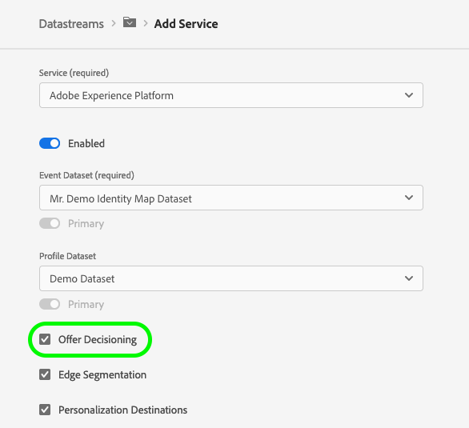

# Personalization

You can retrieve personalized content from Adobe personalization solutions, including [Adobe Target](https://business.adobe.com/products/target/adobe-target.html), [Adobe Journey Optimizer](https://experienceleague.adobe.com/en/docs/journey-optimizer/using/ajo-home), and [Offer Decisioning](https://experienceleague.adobe.com/docs/offer-decisioning/using/get-started/starting-offer-decisioning.html).

You can also get same-page and next-page personalization capabilities through personalization destinations, such as [Adobe Target](https://experienceleague.adobe.com/en/docs/experience-platform/destinations/catalog/personalization/adobe-target-connection) and the [custom personalization connection](https://experienceleague.adobe.com/en/docs/experience-platform/destinations/catalog/personalization/custom-personalization). To learn how to configure Experience Platform for same-page and next-page personalization, see the [dedicated guide](https://experienceleague.adobe.com/en/docs/experience-platform/destinations/ui/activate/activate-edge-personalization-destinations).

When using the Edge Network API, you must integrate the response provided by the personalization engine with the logic used to render content. Unlike the [Web SDK](https://experienceleague.adobe.com/en/docs/experience-platform/web-sdk/home), this API cannot automatically apply content returned by personalization solutions.

## Terminology

Before working with Adobe personalization solutions, make sure to understand the following concepts:

* **Offer**: A marketing message that can have rules associated with it that specify who is eligible to see the offer.
* **Decision**: Informs the selection of an offer. Previously known as an offer activity.
* **Schema**: Informs the type of offer returned based on a decision.
* **Scope**: The scope of the decision.
  * In Adobe Target, the scope is equivalent to the `mbox`. The `global mbox` is the `__view__` scope
  * For Offer Decisioning, scopes are the Base64-encoded strings of JSON containing the activity and placement IDs that you want the offer decisioning service to use to propose offers.

## The `query` object

Retrieving personalized content requires an explicit request query object for a request example. The query object has the following format:

```json
{
  "query": {
    "personalization": {
      "schemas": [
        "https://ns.adobe.com/personalization/html-content-item",
        "https://ns.adobe.com/personalization/json-content-item",
        "https://ns.adobe.com/personalization/redirect-item",
        "https://ns.adobe.com/personalization/dom-action"
      ],
      "decisionScopes": [
        "alloyStore",
        "siteWide",
        "__view__",
        "eyJhY[...]GMifQ"
      ],
      "surfaces": [
        "web://example.html/",
        "web://example.html/#sample-json-content"
      ]
    }
  }
}
```

| Attribute | Type |Required / Optional| Description |
| --- | --- | --- | ---|
| `schemas` | `String[]` | Required for Target personalization. Optional for Offer Decisioning. | List of schemas used in the decision, to select the type of offers returned.|
| `scopes` | `String[]` | Optional| List of decision scopes. Maximum 30 per request. |

## The handle object

The personalized content retrieved from personalization solutions is presented in a `personalization:decisions` handle, which has the following format for its payload:

```json
{
   "type":"personalization:decisions",
   "payload":[
      {
         "id":"AT:eyJhY[...]iMCJ9",
         "scope":"__view__",
         "scopeDetails":{
            "decisionProvider":"TGT",
            "activity":{
               "id":"131010"
            },
            "experience":{
               "id":"0"
            },
            "strategies":[
               {
                  "algorithmID":"0",
                  "trafficType":"0"
               }
            ]
         },
         "items":[
            {
               "id":"0",
               "schema":"https://ns.adobe.com/personalization/dom-action",
               "meta":{
                  "offer.name":"Default Content",
                  "experience.id":"0",
                  "activity.name":"Luma target reporting",
                  "activity.id":"131010",
                  "experience.name":"Experience A",
                  "option.id":"2",
                  "offer.id":"0"
               },
               "data":{
                  "type":"setHtml",
                  "format":"application/vnd.adobe.target.dom-action",
                  "content":"Customer Service not chrome",
                  "selector":"HTML > BODY > DIV.page-wrapper:eq(0) > FOOTER.page-footer:eq(0) > DIV.footer:eq(0) > DIV.links:eq(0) > DIV.widget:eq(0) > UL.footer:eq(0) > LI.nav:eq(1) > A:nth-of-type(1)",
                  "prehidingSelector":"HTML > BODY > DIV:nth-of-type(1) > FOOTER:nth-of-type(1) > DIV:nth-of-type(1) > DIV:nth-of-type(2) > DIV:nth-of-type(1) > UL:nth-of-type(1) > LI:nth-of-type(2) > A:nth-of-type(1)"
               }
            }
         ]
      }
   ]
}
```

| Attribute | Type | Description |
| --- | --- | --- |
| `payload.id` | String | The decision ID. |
| `payload.scope` | String | The decision scope that resulted in the proposed offers. |
| `payload.scopeDetails.decisionProvider`|String| Set to `TGT` when using Adobe Target.|
| `payload.scopeDetails.activity.id` | String | The unique ID of the offer activity. |
| `payload.scopeDetails.experience.id` | String | The unique ID of the offer placement. |
| `items[].id` | String | The unique ID of the offer placement. |
| `items[].data.id` | String | The ID of the proposed offer. |
| `items[].data.schema` | String | The schema of the content associated with the proposed offer. |
| `items[].data.format` | String | The format of the content associated with the proposed offer. |
| `items[].data.language` | String | An array of languages associated with the content from the proposed offer. |
| `items[].data.content` | String | Content associated with the proposed offer in the format of a string. |
| `items[].data.selector` | String | HTML selector used to identify the target DOM element for a DOM action offer. |
| `items[].data.prehidingSelector` | String | HTML selector used to identify the DOM element to be hidden while handling a DOM action offer. |
| `items[].data.deliveryUrl` | String | Image content associated with the proposed offer in the format of a URL. |
| `items[].data.characteristics` | String | Characteristics associated with the proposed offer in the format of a JSON object. |

## Sample API call

<CodeBlock slots="heading, code" repeat="2" languages="CURL,JSON"/>

#### Request

```sh
curl -X POST "https://edge.adobedc.net/ee/v2/interact?datastreamId={DATASTREAM_ID}" \
-H "Content-Type: application/json" \
-d '{
    "event": {
      "xdm": {
        "identityMap": {
          "email": [
            {
              "id": "user@example.com",
              "primary": true
            }
          ]
        },
        "eventType": "web.webpagedetails.pageViews",
        "web": {
          "webPageDetails": {
            "URL": "https://alloystore.dev/",
            "name": "home-demo-Home Page"
          }
        },
        "timestamp": "YYYY-08-09T14:09:20.859Z"
      }
    },
    "query": {
      "personalization": {
        "schemas": [
          "https://ns.adobe.com/personalization/html-content-item",
          "https://ns.adobe.com/personalization/json-content-item",
          "https://ns.adobe.com/personalization/redirect-item",
          "https://ns.adobe.com/personalization/dom-action"
        ],
        "decisionScopes": [
          "__view__",
          "eyJhY[...]GMifQ"
        ]
      }
    }
  }'
```

#### Response

```json
{
  "requestId": "da20d11d-adac-458c-91ac-15bf4e420a15",
  "handle": [
    {
      "payload": [
        {
          "id": "AT:eyJ[...]CJ9",
          "scope": "__view__",
          "scopeDetails": {
            "decisionProvider": "TGT",
            "activity": {
              "id": "131010"
            },
            "experience": {
              "id": "0"
            },
            "strategies": [
              {
                "algorithmID": "0",
                "trafficType": "0"
              }
            ]
          },
          "items": [
            {
              "id": "0",
              "schema": "https://ns.adobe.com/personalization/dom-action",
              "meta": {
                "offer.name": "Default Content",
                "experience.id": "0",
                "activity.name": "Luma target reporting",
                "activity.id": "131010",
                "experience.name": "Experience A",
                "option.id": "2",
                "offer.id": "0"
              },
              "data": {
                "type": "setHtml",
                "format": "application/vnd.adobe.target.dom-action",
                "content": "Customer Service not chrome",
                "selector": "HTML > BODY > DIV.page-wrapper:eq(0) > FOOTER.page-footer:eq(0) > DIV.footer:eq(0) > DIV.links:eq(0) > DIV.widget:eq(0) > UL.footer:eq(0) > LI.nav:eq(1) > A:nth-of-type(1)",
                "prehidingSelector": "HTML > BODY > DIV:nth-of-type(1) > FOOTER:nth-of-type(1) > DIV:nth-of-type(1) > DIV:nth-of-type(2) > DIV:nth-of-type(1) > UL:nth-of-type(1) > LI:nth-of-type(2) > A:nth-of-type(1)"
              }
            }
          ]
        }
      ],
      "type": "personalization:decisions"
    }
  ]
}
```

### Request parameters

| Parameter | Type | Required | Description |
| --- | --- | --- | --- |
| `configId` | String | Yes | The datastream ID. |
| `requestId` | String | No | Provide an external request tracing ID. If none is provided, the Edge Network will generate one for you and return it back in the response body / headers.|

### Response parameters

Returns a `200 OK` status and one or more `Handle` objects, depending on the edge services that are enabled in the datastream configuration.

## Notifications

Send notifications when a prefetched content or view has been visited or rendered to the end user. In order for notifications to be fired off for the right scope, make sure to keep track of the corresponding `id` for each scope.

Notifications with the right `id` for the corresponding scopes are required to be fired in order for reporting to be reflected correctly.

<CodeBlock slots="heading, code" repeat="2" languages="CURL,JSON"/>

#### Request

```sh
curl -X POST "https://edge.adobedc.net/ee/v2/collect?datastreamId={DATASTREAM_ID}" \
-H "Content-Type: application/json" \
-d '{
    "events": [
      {
        "xdm": {
          "identityMap": {
            "email": [
              {
                "id": "user@example.com",
                "primary": true
              }
            ]
          },
          "eventType": "web.webpagedetails.pageViews",
          "web": {
            "webPageDetails": {
              "URL": "https://alloystore.dev/",
              "name": "home-demo-Home Page"
            }
          },
          "timestamp": "YYYY-08-09T14:09:20.859Z",
          "_experience": {
            "decisioning": {
              "propositions": [
                {
                  "id": "AT:eyJ[...]CJ9",
                  "scope": "__view__",
                  "items": [
                    {
                      "id": "0"
                    }
                  ]
                }
              ]
            }
          }
        }
      }
    ]
  }'
```

#### Response

```json
{
  "requestId": "f567a988-4b3c-45a6-9ed8-f283188a445e"
}
```

### Request parameters

| Parameter | Type | Required | Description |
| --- | --- | --- | --- |
| `datastreamId` | `String` | Yes | The ID of the datastream used by the data collection endpoint. |
| `requestId` | `String` | No | External external request tracing ID. If none is provided, the Edge Network will generate one for you and return it back in the response body / headers.|
| `silent` | `Boolean` | No | Optional boolean parameter indicating whether the Edge Network should return a `204 No Content` response with an empty payload. Critical errors are reported using the corresponding HTTP status code and payload.|

### Response parameters

A successful response returns one of the following statuses, and a `requestID` if none was provided in the requst.

* `202 Accepted` when the request was successfully processed;
* `204 No Content` when the request was successfully processed and the `silent` parameter was set to `true`;
* `400 Bad Request` when the request was not properly formed (e.g., the mandatory primary identity was not found).

## Offer Decisioning

The Edge Network API can deliver personalized experiences managed in [Offer Decisioning](https://experienceleague.adobe.com/docs/journey-optimizer/using/offer-decisioniong/get-started-decision/starting-offer-decisioning.html) to the web channel. It supports a non-visual interface to create, activate, and deliver your activities and personalization experiences.

## Prerequisites

Personalization using Offer Decisioning requires the following:

* Access to [Adobe Journey Optimizer](https://experienceleague.adobe.com/docs/journey-optimizer/using/ajo-home.html)
* Offer Decisioning must be enabled in the [Datastream settings](https://experienceleague.adobe.com/en/docs/experience-platform/datastreams/configure#aep).



## Defining decision scopes

The Offer decision engine uses Adobe Experience Platform data and [Real-Time Customer profiles](https://experienceleague.adobe.com/en/docs/experience-platform/rtcdp/home), along with the offer library, to deliver offers to the right customers and channels at the right time.

To learn more about the offer decisioning engine, see the dedicated [documentation](https://experienceleague.adobe.com/docs/journey-optimizer/using/offer-decisioniong/get-started-decision/starting-offer-decisioning.html).

After configuring your datastream, you must define the decision scopes to be used in your personalization campaign.

[Decision scopes](https://experienceleague.adobe.com/docs/journey-optimizer/using/offer-decisioniong/create-manage-activities/create-offer-activities.html#add-decision-scopes) are the Base64-encoded JSON strings containing the activity and placement IDs that you want the offer decisioning service to use when proposing offers.

**Decision scope JSON**

```json
{
   "activityId":"xcore:offer-activity:11cfb1fa93381aca",
   "placementId":"xcore:offer-placement:1175009612b0100c"
}
```

**Decision scope Base64-encoded string**

```sh
"eyJhY3Rpdm[...]EwMGMifQ=="
```

After you have created your offers and collections, define a [decision scope](https://experienceleague.adobe.com/docs/journey-optimizer/using/offer-decisioniong/create-manage-activities/create-offer-activities.html#add-decision-scopes). Copy the Base64-encoded decision scope. It is used in the `query` object of the API request.


```json
"query":{
   "personalization":{
      "decisionScopes":[
         "eyJ4ZG06YW[...]U3ZTdkYiJ9"
      ]
   }
}
```

## Offer Decisioning example

<CodeBlock slots="heading, code" repeat="2" languages="CURL,JSON"/>

#### Request

```sh
curl -X POST 'https://edge.adobedc.net/ee/v2/interact?datastreamId={DATASTREAM_ID}' \
-H 'Content-Type: application/json' \
-d '{
  "event": {
    "xdm": {
      "eventType": "web.webpagedetails.pageViews",
      "identityMap": {
        "ECID": [
          {
            "id": "05907638112924484241029082405297151763",
            "authenticatedState": "ambiguous",
            "primary": true
          }
        ]
      },
      "web": {
        "webPageDetails": {
          "URL": "https://alloystore.dev",
          "name": "Home Page"
        },
        "webReferrer": {
          "URL": ""
        }
      },
      "device": {
        "screenHeight": 1440,
        "screenWidth": 3440,
        "screenOrientation": "landscape"
      },
      "environment": {
        "type": "browser",
        "browserDetails": {
          "viewportWidth": 3440,
          "viewportHeight": 1440
        }
      },
      "placeContext": {
        "localTime": "YYYY-03-22T22:45:21.193-06:00",
        "localTimezoneOffset": 360
      },
      "timestamp": "YYYY-03-23T04:45:21.193Z",
      "implementationDetails": {
        "name": "https://ns.adobe.com/experience/alloy/reactor",
        "version": "1.0",
        "environment": "serverapi"
      }
    },
    "data": {
      "page": {
        "pageInfo": {
          "pageName": "Promotions",
          "siteSection": "Home"
        },
        "promos": {
          "heroPromos": "purse,shoes,sunglasses"
        },
        "customVariables": {
          "testGroup": "orange/black theme"
        },
        "events": {
          "homePage": true
        },
        "products": [
          {
            "productSKU": "abc123",
            "productName": "shirt"
          }
        ]
      },
      "__adobe.target": {
        "profile.eyeColor": "brown",
        "profile.hairColor": "brown"
      }
    }
  },
  "query": {
    "personalization": {
      "decisionScopes": [
        "eyJ4ZG06YW[...]U3ZTdkYiJ9"
      ]
    }
  }
}'
```

#### Response

```json
{
  "requestId": "b375077d-7e1d-4c18-b7d3-e4da0fb4fbc5",
  "handle": [
    {
      "payload": [],
      "type": "personalization:decisions",
      "eventIndex": 0
    },
    {
      "payload": [
        {
          "id": "120d5db7-181c-42c5-8653-88b3cd3e1e69",
          "scope": "eyJ4ZG06YW[...]U3ZTdkYiJ9",
          "activity": {
            "id": "xcore:offer-activity:14efca8941895181",
            "etag": "1"
          },
          "placement": {
            "id": "xcore:offer-placement:12d544ae54e7e7db",
            "etag": "1"
          },
          "items": [
            {
              "id": "xcore:personalized-offer:14efc848a3577d92",
              "etag": "2",
              "schema": "https://ns.adobe.com/experience/offer-management/content-component-json",
              "data": {
                "id": "xcore:personalized-offer:14efc848a3577d92",
                "format": "application/json",
                "language": [
                  "en-us"
                ],
                "content": "{\n\t\"ODEFirstTest\" : \"Personalizaton Content\"\n}",
                "characteristics": {
                  "reporting": "testRequest"
                }
              }
            }
          ]
        }
      ],
      "type": "personalization:decisions",
      "eventIndex": 0
    },
    {
      "payload": [
        {
          "key": "kndctr_53A16ACB5CC1D3760A495C99_AdobeOrg_identity",
          "value": "CiYwN[...]9Lw==",
          "maxAge": 34128000
        }
      ],
      "type": "state:store"
    }
  ]
}
```

If the visitor qualifies for a personalization activity based on data sent to Offer Decisioning, then the relevant activity content is found under the `handle` object, where the type is `personalization:decisions`.

Other content is returned under the `handle` object as well. Other content types are not relevant to Offer Decisioning personalization. If the visitor qualifies for multiple activities, they are contained in an array.

| Property | Description | Example |
| --- | --- | --- |
| `scope` | The decision scope associated with the proposed offers that were returned. | `"scope": "eyJhY3Rpdm[...]EwMGMifQ=="` |
| `activity.id` | The unique ID of the offer activity. | `"id": "xcore:offer-activity:11cfb1fa93381aca"` |
| `placement.id` | The unique ID of the offer placement. | `"id": "xcore:offer-placement:1175009612b0100c"` |
| `items.id` | The unique ID of the proposed offer. | `"id": "xcore:personalized-offer:124cc332095cfa74"` |
| `schema` | The schema of the content associated with the proposed offer. | `"schema": "https://ns.adobe.com/experience/offer-management/content-component-html"` |
| `data.id` | The unique ID of the proposed offer. | `"id": "xcore:personalized-offer:124cc332095cfa74"` |
| `format` | The format of the content associated with the proposed offer. | `"format": "text/html"` |
| `language` | An array of languages associated with the content from the proposed offer. | `"language": [ "en-US" ]` |
| `content` | Content associated with the proposed offer in the format of a string. | `"content": "<p style="color:red;">20% Off on shipping</p>"` |
| `deliveryUrl` | Image content associated with the proposed offer in the format of a URL. | `"deliveryURL": "https://image.jpeg"`|
| `characteristics` | JSON object containing the characteristics associated with the proposed offer. | `"characteristics": { "foo": "bar", "foo1": "bar1" }` |
